# AI Agent & Model Context Protocol (MCP) with Client Credentials Grant and Forward Headers

This project demonstrates a complete ecosystem for building secure, agentic AI applications using the **Model Context Protocol (MCP)**. It showcases how to integrate AI Agents (Claude 4 Sonnet via Bedrock, Gemini 3) with local tools, secure authentication mechanisms, and human-in-the-loop workflows.

## 🔐 Authentication & Authorization Strategy

This workspace implements a robust security model based on **Integration with ServerAuth Service** and **Client Credentials Grant in OAuth 2.1 IETF DRAFT**.

### Core Concepts
*   **Client-Side Authentication**: The End-to-End Application (Chatbox/Client) is responsible for authenticating with the Identity Provider (ServerAuth/API Server) to obtain a **JWT Access Token**.
*   **Token Pass-Through**: The MCP Server **does not** handle login credentials (client_id/secret). Instead, the Client passes the JWT and Tenant ID as HTTP headers (`X-JWT-TOKEN`, `X-TENANT-ID`) with every MCP tool request.
*   **Stateless Validation**: The MCP Server uses Middleware to validate the JWT signature and claims before executing any tool. It then forwards these credentials to the backend services.

### Why this approach?
1.  **Zero Secret Leakage**: Sensitive credentials (`client_secret`) never leave the secure Client environment. They are never exposed to the MCP Server or the AI Model.
2.  **AI Safety**: The AI model is unaware of authentication details, preventing "hallucination hijacking" or accidental leakage in conversation history.
3.  **Stateless & Scalable**: The MCP Server remains fully stateless, requiring no session storage or complex auth state management.
4.  **Standard Compliance**: Aligns with OAuth 2.1 patterns for Bearer Token usage.

### Security Workflow

```mermaid
sequenceDiagram
    participant Client as 🤖 AI Client (Chatbox)
    participant IDP as 🛡️ ServerAuth (API)
    participant MCP as 🔌 MCP Server
    participant Backend as 🏦 ThaiInternal Service (API)

    Note over Client, IDP: 1. Initial Auth
    Client->>IDP: Request Token (Client Credentials)
    IDP-->>Client: Return JWT Access Token

    Note over Client, MCP: 2. Tool Invocation
    Client->>MCP: Call Tool (get_email)<br/>Headers: [Authorization: Bearer JWT, X-Tenant-ID]
    
    rect rgb(255, 240, 230)
        Note right of MCP: 3. Middleware Validation
        MCP->>MCP: Validate JWT Signature & Expiry
        MCP->>MCP: Check Tenant Context
    end

    Note over MCP, Backend: 4. Secure Execution
    MCP->>Backend: API Call (get_email)<br/>Forwarded Headers
    Backend-->>MCP: Data (if AuthZ passes)
    MCP-->>Client: Tool Result
```


## 🏗️ System Architecture

The system consists of four main components interacting to provide a secure and interactive experience.

```mermaid
graph TD
    subgraph "Frontend / Clients"
        Chatbox[🤖 AI Agent Chatbox]
        MCPClient[💻 MCP Client CLI]
    end

    subgraph "Middleware / Protocol"
        MCPServer[🔌 MCP Server]
    end

    subgraph "Backend Services"
        APIServer[🛡️ API Server]
    end

    Chatbox -->|MCP Protocol| MCPServer
    MCPClient -->|MCP Protocol| MCPServer
    
    MCPServer -->|REST API + JWT| APIServer
    
    Chatbox -.->|Auth Request| APIServer
    MCPClient -.->|Auth Request| APIServer

    note[Auth Flow: Clients fetch JWT from API Server <br/>and inject it into MCP headers]
    
    style Chatbox fill:#e1f5fe,stroke:#01579b
    style MCPClient fill:#e1f5fe,stroke:#01579b
    style MCPServer fill:#fff3e0,stroke:#ef6c00
    style APIServer fill:#e8f5e9,stroke:#2e7d32
```



## 📦 Project Components

The project is organized as a monorepo with the following packages:

| Package | Path | Description |
|---------|------|-------------|
| **AI Agent Chatbox** | `packages/ai-agent-chatbox` | A rich CLI chat interface supporting **Bedrock** and **Gemini**. It acts as an intelligent host that can connect to MCP servers to extend its capabilities. |
| **MCP Server** | `packages/mcp-server` | A **FastMCP** based server that exposes tools (`get_email`, `change_email`, `get_chart`) via the Model Context Protocol. It handles secure middleware authentication. |
| **MCP Client** | `packages/mcp-client` | A lightweight CLI tool specifically designed to test and interact with the MCP Server directly, useful for debugging tool definitions and connections. |
| **API Server** | `packages/api-server` | A Node.js/Express backend that acts as the "Source of Truth". It provides the actual business logic, database (mocked), and issues **JWT Tokens** for security. |

## 🚀 Key Technologies

- **AI Models**: Amazon Bedrock (Claude 4 Sonnet), Google Gemini (3.0 Flash).
- **Protocol**: [Model Context Protocol (MCP)](https://modelcontextprotocol.io/) for standardizing tool execution.
- **Frameworks**: 
  - Python: `fastmcp`, `strands` (Agent SDK), `boto3`.
  - Node.js: `express`, `jsonwebtoken`.
- **Security**: JWT (JSON Web Tokens) with header-based injection (`X-JWT-TOKEN`, `X-TENANT-ID`).
- **UI**: `rich` library for beautiful terminal interfaces.

## 🛠️ Prerequisites

- **Python 3.10+**
- **Node.js 16+**
- **Cloud Credentials**:
  - AWS Credentials (for Bedrock access).
  - Google Gemini API Key (for Gemini access).

## 📥 Installation

1. **Clone the repository**:
   ```bash
   git clone <repository-url>
   cd MCP/01
   ```

2. **Install Package Dependencies**:

   *   **API Server**:
       ```bash
       cd packages/api-server
       npm install
       ```
   *   **Python Packages (Chatbox, MCP Server, MCP Client)**:
       It is recommended to create a virtual environment for each or a shared one.
       ```bash
       # Example for one package
       cd packages/ai-agent-chatbox
       pip install -r requirements.txt
       ```
       *(Repeat `pip install -r requirements.txt` for `packages/mcp-server` and `packages/mcp-client`)*

3. **Environment Configuration**:
   Create a `.env` file in `packages/ai-agent-chatbox` with your credentials:
   ```env
   AWS_ACCESS_KEY_ID=...
   AWS_SECRET_ACCESS_KEY=...
   AWS_REGION=...
   GEMINI_API_KEY=...
   ```

## 🏃 Running the Project

You can run the components individually or use the provided convenience scripts.

### Option 1: Using Shell Scripts (Recommended)

We provide scripts to launch the full ecosystem in a split-terminal view (requires a terminal that supports split panes or running in background, otherwise run in separate tabs).

*   **Run the Full AI Agent Chatbox**:
    ```bash
    ./run_full_ai_agent_chat.sh
    ```
    *Starts API Server, MCP Server, and then the Chatbox.*

*   **Run the MCP Client (for testing)**:
    ```bash
    ./run_full_mcp_client.sh
    ```
    *Starts API Server, MCP Server, and then the MCP Client.*

### Option 2: Manual Startup (Separate Terminals)

**Terminal 1: API Server** (Port 3006)
```bash
cd packages/api-server
npm start
```

**Terminal 2: MCP Server** (Port 3005)
```bash
cd packages/mcp-server
python server.py
```

**Terminal 3: AI Agent Chatbox**
```bash
cd packages/ai-agent-chatbox
python chatbox.py
```

## 🔄 Workflows

### 1. Secure Authentication Flow

This project demonstrates how to secure MCP tools using a "Client Credentials" style flow.

1.  **Token Acquisition**: The Client (Chatbox) calls `GET http://localhost:3006/generate-token` to get a short-lived JWT.
2.  **Context Injection**: The Client adds `X-JWT-TOKEN` and `X-TENANT-ID` to the HTTP headers when connecting to the MCP Server.
3.  **Middleware Validation**: The MCP Server's middleware intercepts every tool call, validates the JWT signature and Tenant ID before allowing the tool to execute.

### 2. Human-in-the-Loop (HITL) Email Change

The `change_email` tool implements a safety mechanism requiring user confirmation.


## 🧪 Testing & Verification

1.  **Start the Chatbox**.
2.  **Run Auth**: Type `auth` in the chatbox to fetch a token.
3.  **Test Read**: Ask *"What is the email for account 12345?"*.
    *   *Expected*: Agent calls `get_email` and returns `user@example.com`.
4.  **Test Write (HITL)**: Ask *"Change the email for account 12345 to mynew@email.com"*.
    *   *Expected*: Agent asks for confirmation. Reply "Yes". Agent confirms the change.
5.  **Test Visualization**: Ask *"Show me a chart"*.
    *   *Expected*: Agent calls `get_chart` and an image is displayed/processed.


### Other references and documentations
  1. **Some authentication and authorization mechanism of OAuth**
      - Refer to the following technologies and techniques:
          - Client Credentials Grant in OAuth 2.1 IETF DRAFT
          - Dynamic Client Registration (DCR)
          - OAuth Client ID Metadata (CIMD)
          - URL‑Mode Elicitation in MCP
          - Integrade with AWS Cognito
  
  2. **Detailed Comparison of Authentication & Registration Mechanisms:**

The following table compares **Client Credentials Grant** (as a standard authentication flow), **Dynamic Client Registration (DCR)** (as a registration protocol), and **OAuth Client ID Metadata (CIMD)** (as a decentralized identity/discovery mechanism).

| Feature / Aspect | **Client Credentials Grant (OAuth 2.1)** | **Dynamic Client Registration (DCR) - RFC 7591** | **OAuth Client ID Metadata (CIMD)** |
| :--- | :--- | :--- | :--- |
| **Primary Purpose** | **Authentication**: Machine-to-machine token retrieval. | **Registration**: Automating the creation of client accounts/IDs on the server. | **Identity & Discovery**: Just-in-time identification using a URL as the Client ID. |
| **Registration Model** | **Static/Manual**: Clients are usually pre-registered manually or via a separate portal. | **Active/Push**: Client explicitly calls a registration endpoint to create an account. | **Passive/Pull**: No explicit registration. Server fetches client info from the Client ID URL. |
| **Client Identifier** | Opaque string (e.g., UUID) assigned by the Authorization Server (AS). | Opaque string assigned by the AS upon successful registration. | **URL** (e.g., `https://client.example.com/oauth-client`) controlled by the client. |
| **Trust Establishment** | **Pre-shared Secret**: Trust is based on the possession of `client_id` and `client_secret`. | **Registration Policy**: Trust based on software statements, initial access tokens, or open registration. | **Domain Control**: Trust is based on the client's control over the domain hosting the metadata file. |
| **Metadata Management** | **Server-Stored**: Metadata (redirect URIs, names) is stored statically on the AS. | **Client-Pushed**: Client sends metadata during registration; AS stores it. | **Client-Hosted**: Client hosts its own metadata; AS fetches it on demand. |
| **State Management (AS)** | **High**: AS must maintain a database of all registered clients and their secrets. | **High**: AS must create and persist records for every dynamically registered client. | **Low/Stateless**: AS *can* be stateless, verifying metadata on-the-fly (though caching is recommended). |
| **Updates & Rotation** | **Manual**: Updating keys or redirect URIs often requires admin intervention or API calls. | **API-Driven**: Client calls the management endpoint to update its own metadata. | **Decentralized**: Client simply updates the JSON file on their server; AS sees changes on next fetch. |
| **Security Risks** | **Secret Leakage**: Long-lived secrets can be leaked. <br>**Management Overhead**: Rotation is manual. | **Spam/Abuse**: Malicious clients can flood the registration endpoint (DoS). <br>**Impersonation**: Weak validation of software statements. | **SSRF**: AS fetching URLs poses Server-Side Request Forgery risks. <br>**Availability**: If client server is down, auth fails. |
| **Latency & Performance** | **Lowest**: Direct database lookup for credentials. | **Medium**: Registration call overhead (once), then standard auth performance. | **Highest**: Requires HTTP request to fetch metadata (mitigated by caching). |
| **Scalability** | **Linear**: Database grows with every client. Harder to manage millions of ephemeral clients. | **Linear**: Database grows rapidly with dynamic instances. | **High**: Offloads storage to clients. Excellent for millions of distributed/ephemeral clients. |
| **Implementation Complexity** | **Low**: Standard OAuth flow supported by all libraries. | **High**: Requires implementing registration endpoints, policy checks, and management APIs. | **High**: Requires fetching logic, validation, caching, and SSRF protection on the AS. |
| **Standardization Status** | **Mature**: Core OAuth 2.0/2.1 standard. | **Mature**: RFC 7591 is a stable standard. | **Emerging**: Currently an IETF Draft. |
| **Best Use Case** | Trusted internal services, traditional B2B partners with stable identities. | Mobile apps or devices that need unique credentials per instance but originate from one source. | Decentralized ecosystems, federation, or scenarios with massive numbers of third-party clients. |

## 🤝 Contributing

Please ensure you update the `README.md` of specific packages if you modify their core logic or configuration requirements.


