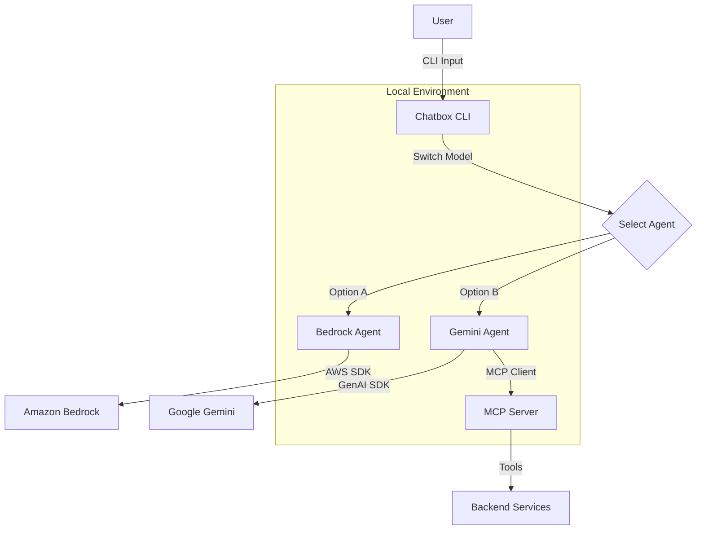

# AI Agent Chatbox

A powerful CLI chat interface for interacting with AI Agents, supporting both **Amazon Bedrock (Claude 3.5 Sonnet)** and **Google Gemini (2.0 Flash)**. This tool features a rich terminal UI, persistent session management, and integration with the Model Context Protocol (MCP).

## Features

- 🤖 **Multi-Model Support**:
  - **Amazon Bedrock**: Claude 3.5 Sonnet
  - **Google Gemini**: Gemini 2.0 Flash
- 🔌 **MCP Integration**: Connects to local MCP servers (default: `http://127.0.0.1:3005/mcp`) for extended tool capabilities.
- 🔐 **Dynamic Authentication**: Built-in `auth` command to fetch JWT tokens and set Tenant IDs for secure MCP tool execution.
- 💾 **Session Management**: Persistent conversation history and state using `strands`.
- 🎨 **Rich UI**: Beautiful terminal interface with markdown rendering, syntax highlighting, and status spinners.
- 🔄 **Hot Switching**: Switch between AI models instantly during a session.

## Architecture



## Prerequisites

1. **Python 3.10+**
2. **Credentials**:
   - **AWS Credentials** (for Bedrock)
   - **Gemini API Key** (for Gemini)
3. **MCP Server** (Optional): A running MCP server at `http://127.0.0.1:3005` if you want to use tools.

## Installation

1. Navigate to the package directory:
   ```bash
   cd packages/ai-agent-chatbox
   ```

2. Install dependencies:
   ```bash
   pip install -r requirements.txt
   ```

## Configuration

Create a `.env` file in the `packages/ai-agent-chatbox` directory with the following variables:

```env
# AWS Credentials (for Bedrock)
AWS_ACCESS_KEY_ID=your_access_key
AWS_SECRET_ACCESS_KEY=your_secret_key
AWS_SESSION_TOKEN=your_session_token
AWS_REGION=eu-west-1

# Google Gemini Credentials
GEMINI_API_KEY=your_gemini_api_key
```

> **Note**: For AWS Bedrock, ensure you have requested access to the `Claude 3.5 Sonnet` model in the AWS Console.

## Usage

### Start the Chatbox

Run the chatbox with the default settings (starts with Gemini):

```bash
python chatbox.py
```

Or specify a model and session ID:

```bash
python chatbox.py --model bedrock --session-id my-session-123
```

### In-Chat Commands

Once inside the chatbox, you can use the following commands:

| Command | Description |
|---------|-------------|
| `switch` | Toggle between **Bedrock** and **Gemini** models. |
| `auth` | Run the authentication flow to fetch a JWT token and set a Tenant ID. This is required for MCP tools that need authorization. |
| `history`| View the full conversation history for the current session. |
| `clear` | Clear the terminal screen. |
| `exit` / `quit` | Close the application. |

### Authentication Flow (`auth` command)

The `auth` command is designed to help you test secure MCP tools. When you run it:
1. It attempts to fetch a **JWT Token** from a local auth service (`http://localhost:3006/generate-token`).
2. It prompts you to enter a **Tenant ID** (default: `test123`).
3. It re-initializes the Gemini agent with these credentials injected into the MCP client headers (`X-JWT-TOKEN`, `X-TENANT-ID`).

## Project Structure

```
ai-agent-chatbox/
├── agent_aws_bedrock.py  # Bedrock Agent implementation
├── agent_gemini.py       # Gemini Agent implementation with MCP Client
├── chatbox.py            # Main CLI application and UI logic
├── requirements.txt      # Dependencies
├── sessions/             # Directory where conversation state is persisted
└── README.md            # This file
```

## Troubleshooting

- **AWS Errors**: Ensure your environment variables are set correctly and that your IAM user has permissions for Bedrock.
- **Gemini Errors**: Verify your `GEMINI_API_KEY` is valid.
- **MCP Connection Refused**: Ensure your MCP server is running on port `3005`.
- **Auth Command Fails**: Ensure the auth service mock is running on port `3006` (if applicable) or manually adjust the URL in `chatbox.py`.

## Future Enhancements

- [ ] Configurable MCP server URL via CLI args.
- [ ] Multi-turn tool execution visualization.
- [ ] Support for local LLMs (Ollama).


## Author
- **Name**: Thai Phung
- **Created on**: 11/2025
